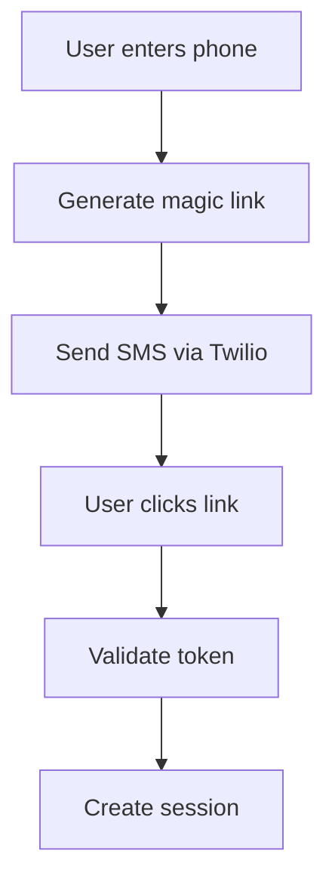
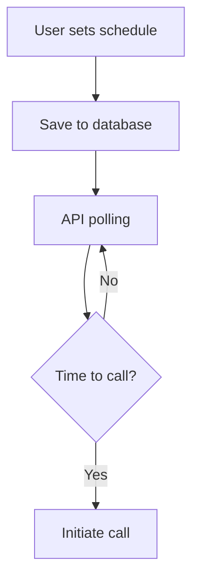
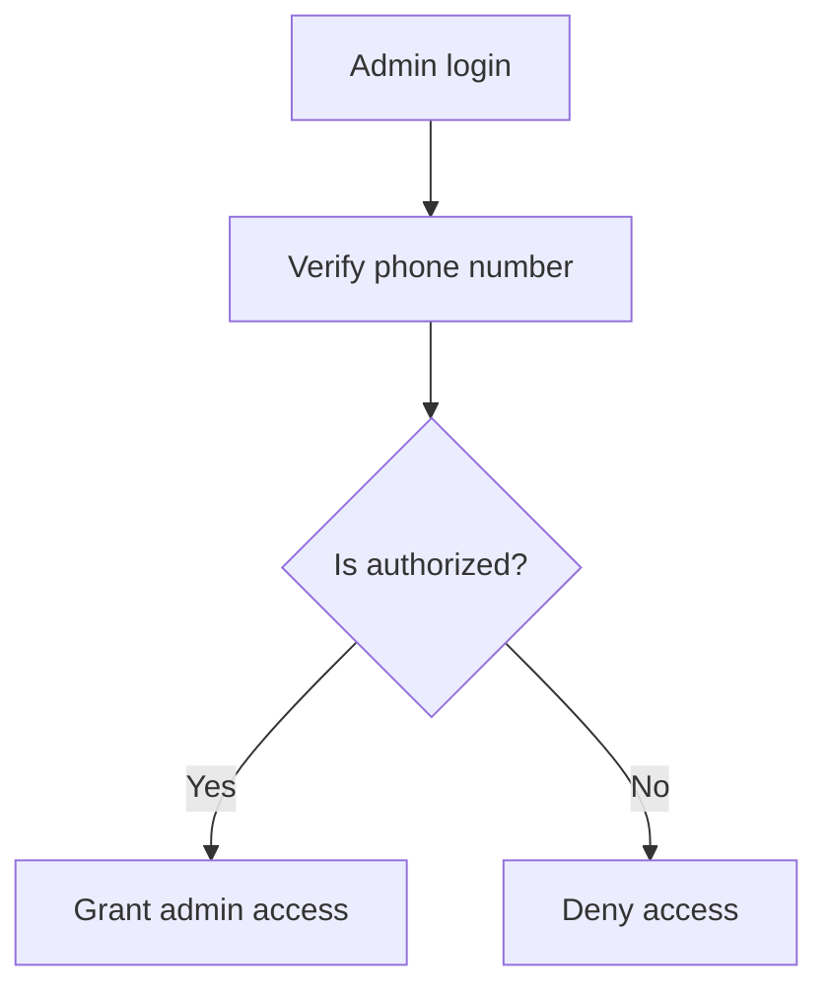

# System Patterns: Morning Kindness

## Architecture Overview

### Frontend Architecture
1. Next.js Application
   - Pages-based routing
   - Server-side rendering where appropriate
   - API routes for backend functionality
   - Mobile-first responsive design

2. Component Structure
   - Shared components for reusability
   - Page-specific components
   - Admin-specific components
   - Authentication components

### Backend Architecture
1. Database Layer (Prisma + Supabase)
   - PostgreSQL database
   - Prisma ORM for type-safe queries
   - Connection pooling for scalability

2. Authentication System
   - SMS magic link flow
   - JWT session management
   - Admin access control
   - Secure token handling

3. External Services Integration
   - Twilio for SMS and voice calls
   - Vercel for hosting and deployment
   - GitHub Actions for CI/CD

## Key Design Patterns

### Authentication Pattern

### Scheduler Pattern

### Admin Access Pattern

## Data Models

### User Model
- Phone number (primary identifier)
- Timezone
- Schedule settings
- Authentication tokens
- Created/Updated timestamps

### Schedule Model
- User reference
- Day of week
- Wake-up time
- Active status
- Created/Updated timestamps

### Greeting Model
- MP3 file URL
- Associated phone number
- Usage metrics
- Created/Updated timestamps

## API Structure

### Public Endpoints
1. Authentication
   - `/api/auth/request-link`
   - `/api/auth/verify`
   - `/api/auth/logout`

2. Schedule Management
   - `/api/schedule/get`
   - `/api/schedule/update`
   - `/api/schedule/delete`

### Admin Endpoints
1. Greetings Management
   - `/api/admin/greetings`
   - `/api/admin/greetings/[id]`

2. User Management
   - `/api/admin/users`
   - `/api/admin/users/[id]`

### System Endpoints
1. Wake-up Service
   - `/api/wake-up/check` (5-min polling)
   - `/api/wake-up/initiate`
   - `/api/wake-up/complete`

## Testing Strategy
1. Unit Tests
   - Component testing
   - API route testing
   - Utility function testing

2. Integration Tests
   - Authentication flow
   - Scheduling system
   - Admin functionality

3. E2E Tests
   - Complete user journeys
   - Critical paths
   - Error scenarios

## Error Handling
1. Frontend Errors
   - Form validation
   - API error handling
   - User feedback

2. Backend Errors
   - Input validation
   - Service integration errors
   - Database errors

3. System Errors
   - Wake-up call failures
   - SMS delivery issues
   - Database connection issues
